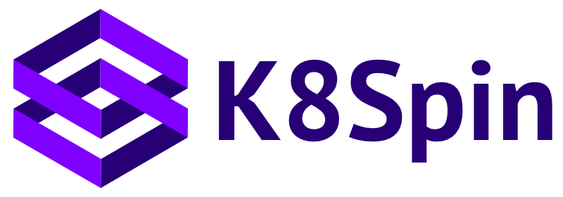

# K8Spin Operator


[](https://www.gnu.org/licenses/gpl-3.0)

[](https://twitter.com/k8spin)
[](https://slack.kubernetes.io)

Kubernetes multi-tenant operator. Enables multi-tenant capabilities in your Kubernetes Cluster.

[](https://k8spin.cloud)

------

## Features

The main features included in the Operator:

- **Enable Multi-Tenant:** Adds three new hierarchy concepts *(Organizations, Tenants, and Spaces)*.
- **Secure and scalable cluster management delegation:** Cluster Admins creates Organizations
then delegating its access to users and groups.
- **Cluster budget management:** Assigning resources in the organization definition makes it possible to
understand how many resources are allocated to a user, team, or the whole company.

## Concepts

K8Spin manages the multi-tenant feature with three simple concepts:

- **Organization**: Created by a cluster administrator, hosts **tenants**. Cluster administrator
can set compute quotas for the whole Organization and grant permissions to users and/or groups.
- **Tenant**: A tenant can be created by an Organization administrator hosting **spaces**. The Tenant administrator
can fix compute quotas and assign roles to users and/or groups. Tenants resources should fit into
Organization resources.
- **Space**: Tenant administrators can create Spaces. Space is an abstraction layer on top of
a Namespace. A tenant administrator should assign quotas and roles to Space. Space resources should fit
into Tenant resources.

## TL;DR

Clone this repo, cd into it and:

### Install with Helm 3

Take a look to the [K8Spin helm chart documentation](deployments/helm/k8spin-operator/README.md).

```bash
# Create a local cluster
$ kind create cluster
# Deploy cert-manager
$ helm repo add jetstack https://charts.jetstack.io
$ helm repo update
$ helm install cert-manager jetstack/cert-manager --version v1.0.4 --set installCRDs=true
$ kubectl wait --for=condition=Available deployment --timeout=2m -n cert-manager --all
# Deploy K8Spin operator
$ export HELM_EXPERIMENTAL_OCI="1"
$ helm chart pull ghcr.io/k8spin/k8spin-operator-chart:v1.0.4
v1.0.4: Pulling from ghcr.io/k8spin/k8spin-operator-chart
ref:     ghcr.io/k8spin/k8spin-operator-chart:v1.0.4
name:    k8spin-operator
version: v1.0.4
Status: Downloaded newer chart for ghcr.io/k8spin/k8spin-operator-chart:v1.0.4
$ helm chart export ghcr.io/k8spin/k8spin-operator-chart:v1.0.4
$ helm install k8spin-operator ./k8spin-operator
$ kubectl wait --for=condition=Available deployment --timeout=2m --all
```

### Install with kubectl

```bash
# Create a local cluster
$ kind create cluster
# Deploy cert-manager
$ kubectl apply -f deployments/kubernetes/cert-manager/cert-manager.yaml
$ kubectl wait --for=condition=Available deployment --timeout=2m -n cert-manager --all
# Deploy K8Spin operator
$ kubectl apply -f ./deployments/kubernetes/crds/ -n default
$ kubectl apply -f ./deployments/kubernetes/roles/ -n default
$ kubectl apply -f ./deployments/kubernetes/ -n default
$ kubectl wait --for=condition=Available deployment --timeout=2m -n default --all
```

Now you are ready to use the operator

```bash
$ kubectl apply -f examples/org-1.yaml
organization.k8spin.cloud/example created
$ kubectl apply -f examples/tenant-1.yaml
tenant.k8spin.cloud/crm created
$ kubectl apply -f examples/space-1.yaml
space.k8spin.cloud/dev created
```

As cluster-admin check organizations:

```bash
$ kubectl get org
NAME      AGE
example   86s
```

If you have installed the [K8Spin kubectl plugin](docs/kubectl-plugin.md):

```bash
$ kubectl k8spin get org
Name                CPU                 Memory
example             10                  10Gi
```

As `example` organization admin get available tenants:

```bash
kubectl get tenants -n org-example --as Angel --as-group "K8Spin.cloud"
NAME   AGE
crm    7m31s
```

As `crm` tenant admin get spaces:

```bash
$ kubectl get spaces -n org-example-tenant-crm --as Angel --as-group "K8Spin.cloud"
NAME   AGE
dev    9m24s
```

Run a workload in the dev space:

```bash
$ kubectl run nginx --image nginx --replicas=2 -n org-example-tenant-crm-space-dev --as Angel --as-group "K8Spin.cloud"
pod/nginx created
```

Discover workloads in the dev space as space viewer:

```bash
$ kubectl get pods -n org-example-tenant-crm-space-dev --as Pau
NAME    READY   STATUS    RESTARTS   AGE
nginx   1/1     Running   0          66s
```

## Documentation

Discover all the power of this operator [reading all the documentation](docs)

## Contributing

We would love you to contribute to `@k8spin/k8spin-operator`, pull requests are welcome! Please see the [CONTRIBUTING.md](CONTRIBUTING.md) for more information.

## Using k8spin at work or in production?

See [ADOPTERS.md](ADOPTERS.md) for what companies are doing with k8spin today.

## License

The scripts and documentation in this project are released under the [GNU GPLv3](LICENSE)
